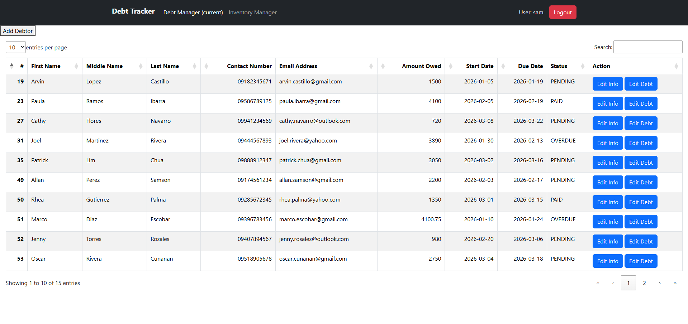
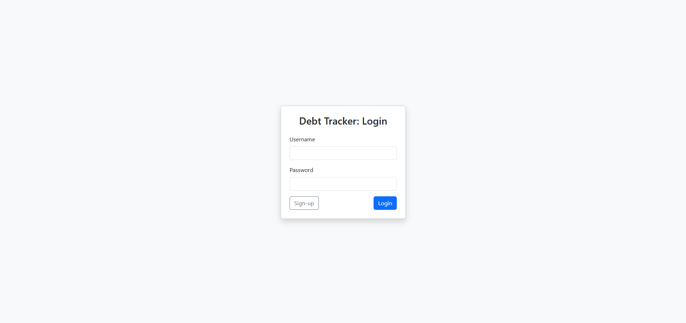
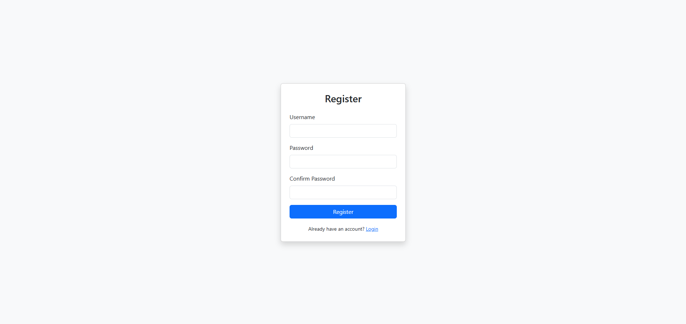
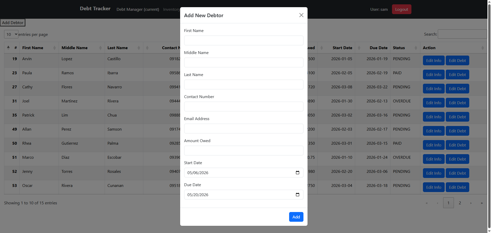
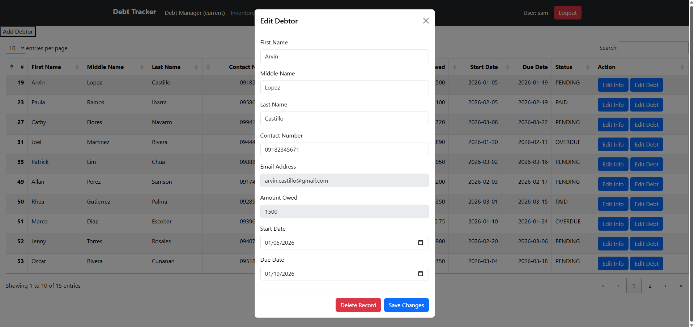
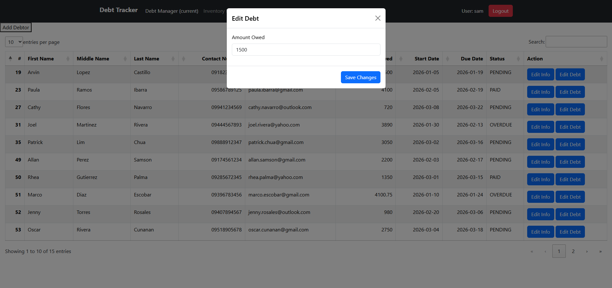

# DEBT TRACKER FOR MSMEs

This is a simple website that offers a simple and intuitive debt tracker, specifically for micro, small, and medium enterprises (MSMEs). Most debt tracker sites tend to be cluttered with features that are only practical for large enterprises such as taxing, interest rates, and whatnot.

This simple debt tracker website seeks to alleviate said problems and offer these small enterprises :)

## Dashboard Overview

## UI Flow
1. The user starts at the login page where they have the option to register or sign-in.

2. Once the user successfully logs in, they are redirect into the dashboard. This dashboard directly displays all debtors that are indebted to said user.

3. The user can then utilize CRUD functions in order to customize and update debt information as shown in the dashboard modals in the next section.

## Dashboard Modals

## Setup Instructions
- Place the entire folder inside the desired local hosting application (Such as XAMPP)
- Start APACHE/NGINX and MySQL
- Run the appropriate url and location
- Enjoy!

## Features Implemented So Far...
This simple debt tracker site offers an intuitive and less-cluttered way of tracking debt for MSMEs instead of sticking to ledgers and manual labor.

### Features present:
- Adding debtors is a piece of cake
- Editing debtor's information is a click away
- Editing their debt is also easy
- Functional search bar
- Functional pagination
- Column sorting

## Features to be (hopefully) implemented...
This website is intended to be a mashup of debt tracking and an inventory management system.

### Features to be added:
- Directly calculating debt through the inventory manager
- Inventory manager for adding products
- Sales tracking
- Better UI/UX